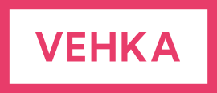

# Vehkavaraus

## Built with

[![Next][Next.js]][Next-url]
[![React][React.js]][React-url]

## About the project

Vehkavaraus is a website created for the tenants of Vehkapolku to mark and track the borrows of communal board games. Users are required to verify their emails before any borrows can be made.

Admin tools are included to add new games or to make changes to the status of borrowed games if needed. 

Images are stored on a Vercel blob and new images are comporessed on the client side before being to sent to the blob. The PostgreSQL database is hosted on Neon and Kysely is used to query the data.

The site is hosted on Vercel

[Next.js]: https://img.shields.io/badge/next.js-000000?style=for-the-badge&logo=nextdotjs&logoColor=white
[Next-url]: https://nextjs.org/
[React.js]: https://img.shields.io/badge/React-20232A?style=for-the-badge&logo=react&logoColor=61DAFB
[React-url]: https://reactjs.org/
